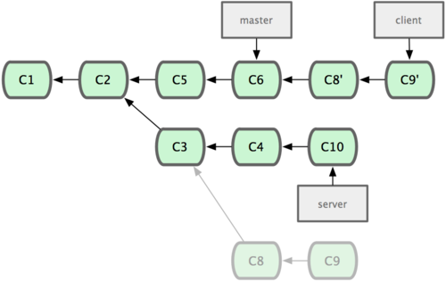

======================================
Desenvolvimento paralelo em *branches*
======================================

Ilustrações
===========

*Topic branch*: para uma tarefa específica
------------------------------------------

.. image:: figuras/fig0319-tn.png

História de um desenvolvimento em *branches*
--------------------------------------------

Vários branches
+++++++++++++++

.. image:: figuras/fig0320-tn.png

Primeiro merge
++++++++++++++

.. image:: figuras/fig0321-tn.png

Segundo merge
+++++++++++++

.. image:: figuras/fig0327-tn.png

Situação final
++++++++++++++

.. image:: figuras/fig0328-tn.png

Exemplo simples de rebase
-------------------------

Compare com a situação final acima.

.. image:: figuras/fig0329-tn.png

Exemplo mais realista de rebase
-------------------------------

Estágio 1
+++++++++

.. image:: figuras/fig0331-tn.png

Estágio 2
+++++++++

Estágio 3
+++++++++

.. image:: figuras/fig0333-tn.png

Estágio 4
+++++++++

.. image:: figuras/fig0334-tn.png

Estágio 5
+++++++++

.. image:: figuras/fig0335-tn.png

Receitas
========

Criar um e ativar um *branch*
-----------------------------

Ver *branches* locais::

	git branch

Criar novo branch para uma tarefa específica::

	git branch tarefa123

Ativar o branch, sincronizando a área de trabalho::

	git checkout tarefa123

Integrar os *commits* de um *branch*
------------------------------------

Depois de fazer *commits* no *branch* da tarefa, ativar *branch* de integração::

	git checkout desenv
	git merge tarefa123

Se tudo correu bem no ``merge``, o *branch* da tarefa pode até ser removido::

	git branch -d tarefa123

